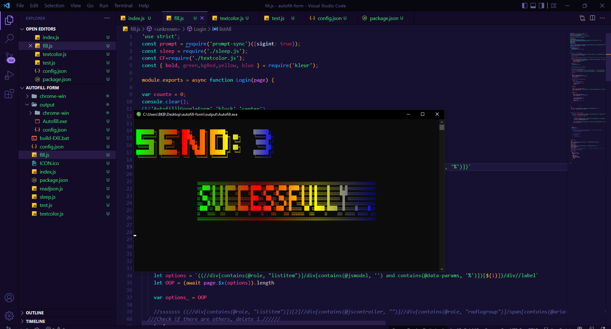

## Bot Google Form
* สิ่งนี้จะช่วยกรอก Form ให้คุณอัตโนมัติ โดยมันจะสุ่มการตอบในแต่ละรอบเพื่อให้เป็นธรรมชาติที่สุด อย่างไรก็ตาม ในเวอร์ชั่นแรกนี้ ไม่สามารถกรอกข้อมูลในรูปแบบข้อความได้อาจจำเป็นต้องพัฒนาเพิ่มเติมในอนาคต และการตอบ จะเป็นการเลือกตอบด้วยการทำเครื่องหมายเพียงเท่านั้น เช่น การเลือกตอบแบบ radio , checkbox เป็นต้น*

##### เมื่อเปิดขึ้นมาเจอหน้าต่างนี้ให้ระบุจำนวณรอบที่ต้องการ spam Form

##### หน้าจอเมื่อสิ้นสุดกระบวนการ Spam Form

	
### การติดตั้ง
   
    ==========1.Download==============
    ** Clone Project นี้ด้วย git clone https://github.com/chalitguza/autofill-Google-Form.git
    หรือ
    **ทำการตรวจสอบเวอร์ชั่นล่าสุดสำหรับปรับใช้กับ PC  ของคุณแบบทันที >> https://github.com/chalitguza/autofill-Google-Form/releases
    ==========2.ทำให้มันทำงาน===========
    ** แตกไฟล์ที่ Download มาให้เรียบร้อย คุณจะพบ config.json ภายในนั้นให้คุณเปลี่ยน URL Google form  ของคุณ ด้วย notepad++ หรืออื่นๆ 
    ** เริ่มการเรียกใช้งาน ด้วยไฟล์ Autofill.exe
    Dev.. FB.COM/BKBBIRD
    =========================
-------------------------------------------------------------------------
   

